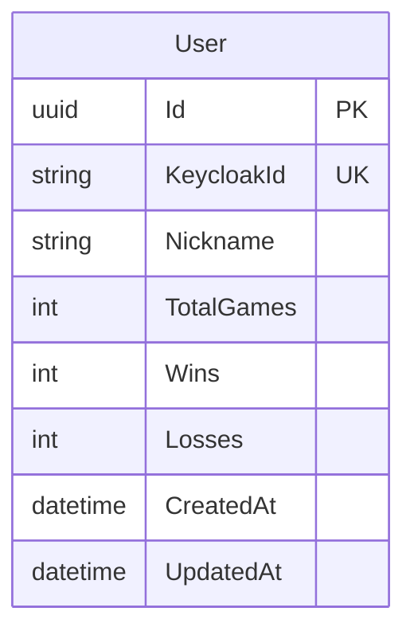
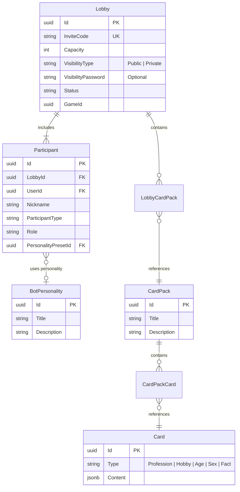

# Bunker Database Architecture and Schemas

This document defines the database architecture for the Bunker project, providing both visual relationships and detailed SQL definitions for clarity.

## 1. Technology Selection & Rationale

We use a polyglot persistence strategy tailored to domain lifecycles.

### 1.1 PostgreSQL (Relational Source of Truth)
**Used by:** `PlayerService`, `LobbyService`, `GameStateService` (Checkpoints)
**Rationale:**
*   **Consistency:** ACID compliance for persistent profiles and statistics.
*   **Complex Queries:** Relational querying for the Lobby Browser (filtering by capacity, visibility, state).
*   **Wolverine Outbox:** Native support for the Transactional Outbox pattern via EF Core.

### 1.2 Redis (Operational State)
**Used by:** `GameStateService` (Active Engine)
**Rationale:**
*   **Performance:** Sub-millisecond latency for high-frequency game state transitions (votes, proposals).
*   **Concurrency:** Optimistic concurrency via version tracking in serialized state snapshots.

---

## 2. Player Service (PostgreSQL)

Stores persistent user profiles linked to Keycloak identities.

### 2.1 Entity Relationship


### 2.2 SQL Definition
```sql
CREATE TABLE "Users" (
    "Id" uuid PRIMARY KEY,
    "KeycloakId" varchar(255) UNIQUE NOT NULL, -- Keycloak 'sub' claim
    "Nickname" varchar(32) NOT NULL,
    "TotalGames" int NOT NULL DEFAULT 0,
    "Wins" int NOT NULL DEFAULT 0,
    "Losses" int NOT NULL DEFAULT 0,
    "CreatedAt" timestamptz NOT NULL DEFAULT now(),
    "UpdatedAt" timestamptz NOT NULL DEFAULT now()
);

CREATE INDEX "IX_Users_Nickname" ON "Users" ("Nickname");
```

---

## 3. Lobby Service (PostgreSQL)

Manages the pre-game gathering phase.

### 3.1 Entity Relationship


### 3.2 SQL Definition
```sql
CREATE TABLE "BotPersonalities" (
    "Id" uuid PRIMARY KEY,
    "Title" varchar(100) NOT NULL,
    "Description" text NOT NULL,
    "CreatedAt" timestamptz NOT NULL DEFAULT now()
);

CREATE TABLE "CardPacks" (
    "Id" uuid PRIMARY KEY,
    "Title" varchar(100) NOT NULL,
    "Description" text NOT NULL,
    "CreatedAt" timestamptz NOT NULL DEFAULT now()
);

CREATE TABLE "Cards" (
    "Id" uuid PRIMARY KEY,
    "Type" varchar(20) NOT NULL, -- Discriminator
    "Content" jsonb NOT NULL,      -- Specific card data
    "CreatedAt" timestamptz NOT NULL DEFAULT now()
);

CREATE TABLE "CardPackCards" (
    "CardPackId" uuid NOT NULL REFERENCES "CardPacks"("Id") ON DELETE CASCADE,
    "CardId" uuid NOT NULL REFERENCES "Cards"("Id") ON DELETE CASCADE,
    PRIMARY KEY ("CardPackId", "CardId")
);

CREATE TABLE "Lobbies" (
    "Id" uuid PRIMARY KEY,
    "InviteCode" varchar(12) UNIQUE NOT NULL,
    "Capacity" int NOT NULL,
    "VisibilityType" varchar(10) NOT NULL, -- 'Public', 'Private'
    "VisibilityPassword" varchar(255) NULL, -- Only for Private lobbies
    "Status" varchar(20) NOT NULL,          -- 'Waiting', 'InGame'
    "GameId" uuid NULL,                     -- Soft link to GameSession
    "CreatedAt" timestamptz NOT NULL DEFAULT now()
);

CREATE TABLE "LobbyCardPacks" (
    "LobbyId" uuid NOT NULL REFERENCES "Lobbies"("Id") ON DELETE CASCADE,
    "CardPackId" uuid NOT NULL REFERENCES "CardPacks"("Id"),
    PRIMARY KEY ("LobbyId", "CardPackId")
);

CREATE TABLE "Participants" (
    "Id" uuid PRIMARY KEY,
    "LobbyId" uuid NOT NULL REFERENCES "Lobbies"("Id") ON DELETE CASCADE,
    "UserId" uuid NULL,                -- Soft link to PlayerService.Users
    "Nickname" varchar(32) NOT NULL,
    "ParticipantType" varchar(10) NOT NULL, -- 'Human', 'Bot'
    "Role" varchar(10) NULL,           -- 'Host', 'Member'
    "Status" varchar(10) NULL,         -- 'Ready', 'NotReady'
    "PersonalityPresetId" uuid NULL REFERENCES "BotPersonalities"("Id"),
    "JoinedAt" timestamptz NOT NULL DEFAULT now()
);

CREATE INDEX "IX_Lobbies_Visibility_Status" ON "Lobbies" ("VisibilityType", "Status");
CREATE UNIQUE INDEX "IX_Participants_Lobby_User" ON "Participants" ("LobbyId", "UserId") WHERE "UserId" IS NOT NULL;
```

---

## 4. Game State Service (PostgreSQL + Redis)

### 4.1 SQL Definition (Checkpoints)
```sql
CREATE TABLE "GameSessions" (
    "Id" uuid PRIMARY KEY,
    "LobbyId" uuid NOT NULL,
    "Status" varchar(20) NOT NULL, -- 'Active', 'Completed'
    "StartedAt" timestamptz NOT NULL DEFAULT now(),
    "EndedAt" timestamptz NULL
);

CREATE TABLE "GameCheckpoints" (
    "Id" uuid PRIMARY KEY,
    "GameSessionId" uuid NOT NULL REFERENCES "GameSessions"("Id") ON DELETE CASCADE,
    "RoundNumber" int NOT NULL,
    "StatePayload" jsonb NOT NULL,
    "CreatedAt" timestamptz NOT NULL DEFAULT now()
);

CREATE UNIQUE INDEX "IX_Checkpoints_Session_Round" ON "GameCheckpoints" ("GameSessionId", "RoundNumber");
```

### 4.2 Redis Snapshot (Hot State)
**Key Pattern:** `bunker:game:{game_id}:state`
```json
{
  "GameId": "uuid",
  "Version": 42,
  "CurrentRound": 2,
  "Phase": "Discussion",
  "BunkerCapacity": 3,
  "Players": [
    {
      "Id": "uuid",
      "Status": "Alive",
      "RevealedCards": [],
      "SecretCards": []
    }
  ]
}
```

---

## 5. Wolverine Transactional Outbox

Wolverine creates the following tables in each DB schema to manage reliable messaging:

*   `wolverine_incoming_messages`: Buffers messages received from RabbitMQ.
*   `wolverine_outgoing_messages`: Buffers messages to be sent to RabbitMQ (Staged during DB transactions).
*   `wolverine_scheduled_messages`: Manages delayed execution.
